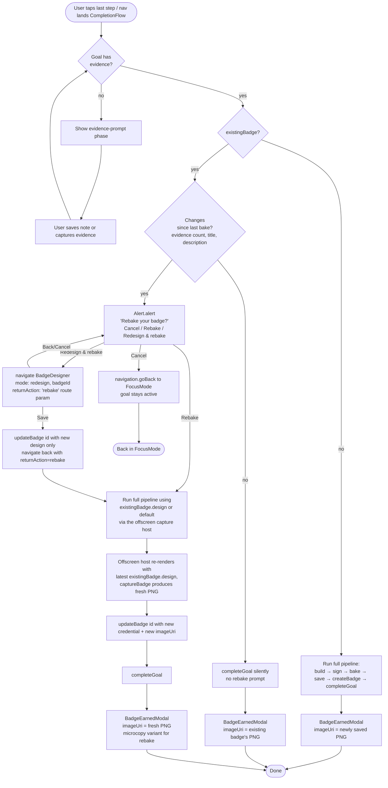

# Badge Completion + Reopen Flow Spec

**Status:** Spec — pre-implementation
**Created:** 2026-05-14
**Related:** [2026-05-14-badge-rebake-on-reopen.md](./2026-05-14-badge-rebake-on-reopen.md) — implementation plan that follows from this spec
**Tracking issue:** [#15](https://github.com/rollercoaster-dev/Rollercoaster.dev-mobile/issues/15)

## Why this exists

Issue #15 surfaced a behaviour problem in re-completion. Before writing code, we want a single artifact that captures **what the user-facing flow should be** so the implementation plan has something to verify against.

This doc describes the desired flow. The implementation sketch (status names, file locations, test list) is in the [rebake-on-reopen plan](./2026-05-14-badge-rebake-on-reopen.md).

## The bug as observed

Reproduction on a fresh install (single session, no rebuild between completions):

1. Create goal, design badge, complete with evidence → `BadgeEarnedModal` shows the freshly baked badge image. ✅
2. From the celebration screen, tap **Reopen Goal**.
3. Add a new step, complete it, add new evidence.
4. Auto-nav from `FocusModeScreen` lands `CompletionFlowScreen`.
5. `BadgeEarnedModal` opens — **the badge image area is empty**.

The modal still has "Badge earned." plus View/Customize/Keep going. Only the 120×120 image slot is blank.

## Why it happens today

`apps/native-rd/src/hooks/useCreateBadge.ts:124-128`:

```ts
if (existingBadge) {
  setStatus("done");
  return;
}
```

On re-completion the hook finds the badge written by the first completion and short-circuits to `done` without baking anything. `CompletionFlowScreen.tsx:543` then passes the **original** `imageUri` to the modal:

```ts
imageUri={badgeRow.imageUri ?? PLACEHOLDER_IMAGE_URI}
```

Two reasons the slot ends up blank rather than stale-but-visible:

1. **No `onError` fallback in `BadgeEarnedModal`.** `BadgeDetailScreen.tsx:117,164,306` tracks `imageLoadFailed` and falls back to a design-rendered or initial-letter tile. The modal at `BadgeEarnedModal.tsx:83-99` only branches on `imageUri !== PLACEHOLDER_IMAGE_URI` — if the URI looks valid but the file can't load, nothing renders.
2. **The short-circuit is the deeper issue.** Even when the file resolves, the credential is frozen at the first bake. The user added evidence after reopening; the badge they see — and the OB3 credential inside it — does not reflect those additions.

These compound: the modal looks empty, *and* even if it didn't, it would be misleading.

## Desired flow



## User-journey walkthroughs

### A. First completion (no existingBadge)

1. User completes last step → auto-nav to `CompletionFlowScreen`.
2. Evidence-prompt phase if no evidence yet; once evidence exists, transition to celebration.
3. `useCreateBadge` runs full pipeline. Modal opens with the freshly baked PNG.
4. Tap **View Badge** → `BadgeDetailScreen`. Tap **Keep going** → dismiss.

### B. Re-completion, no changes since first bake (accidental reopen)

1. User reopens, doesn't change anything, navigates back to completion (e.g. via the unchanged last step or directly).
2. `useCreateBadge` detects `existingBadge` + `goal.status === active` + no diff vs credential snapshot.
3. Silently calls `completeGoal`. Modal shows the original badge image.
4. **No** rebake prompt — accidental reopens should be invisible.

### C. Re-completion with new evidence (the bug case)

1. User reopens, adds new step + new evidence, completes last step.
2. Auto-nav to `CompletionFlowScreen`.
3. `useCreateBadge` detects `existingBadge` + active + diff (evidence count changed).
4. Sets status `"rebake-required"`. `CompletionFlowScreen` fires `Alert.alert` with three buttons:
   - **Cancel** → `navigation.goBack()`, goal stays active. User can come back later.
   - **Rebake** → set `rebakeConfirmed`. The offscreen fallback host in `CompletionFlowScreen.tsx:312-329` renders `existingBadge.design` (or `createDefaultBadgeDesign(...)`) and captures a fresh PNG. The rebake pipeline takes that PNG, rebuilds the credential with the new evidence, signs, bakes, and calls `updateBadge(badgeId, { credential, imageUri })`, then `completeGoal`. Modal shows the new image.
   - **Redesign & rebake** → `navigation.navigate("BadgeDesigner", { mode: "redesign", badgeId, returnAction: "rebake" })`. The existing redesign mode (`BadgeDesignerScreen.tsx:487-502`) calls `updateBadge(badgeId, { design })` on save — design-only update, no PNG. On save with `returnAction === "rebake"` the designer navigates back with a route param signalling "proceed to rebake." `CompletionFlowScreen` reads that param, sets `rebakeConfirmed = true`, and the rebake pipeline runs — `existingBadge.design` is now the new design (via the reactive `badgeByGoalQuery`), so the offscreen capture host re-renders and produces a PNG of the new design.
5. **Back / Cancel** in the designer returns to the Alert without saving and without flipping `rebakeConfirmed`. The user can pick a different button.
6. Microcopy — see the [Microcopy](#microcopy) section below.

> **Implementation note.** This deliberately re-uses two existing primitives instead of inventing new ones:
> - The redesign mode's `updateBadge({ design })` write is exactly what we'd do anyway, so no new designer mode is required.
> - The offscreen fallback capture host at `CompletionFlowScreen.tsx:312-329` already produces a PNG from a `BadgeDesign`. We just need it to fire for the rebake branch when `existingBadge.design` resolves to something usable, not only when `pendingDesignStore` is empty.

### D. Re-completion with edited goal title/description, no new evidence

Same as **C**. Title/description are part of the credential's frozen snapshot; changing them counts as "changes since bake."

## Microcopy

Aligned with `~/Code/rollercoaster.dev/landing/docs/BRAND_LANGUAGE.md`: direct, no exclamation points, no praise theatre, no warnings dressed up as alerts. Matches the existing in-app pattern (`"Badge earned."` / `"First one. (noted.)"` at `BadgeEarnedModal.tsx:56`).

### Alert — changes detected on re-completion

| Slot         | Copy                                                                                  | Notes                                                                                              |
| ------------ | ------------------------------------------------------------------------------------- | -------------------------------------------------------------------------------------------------- |
| Title        | `Rebake your badge?`                                                                   | Sentence case for iOS Alert convention. Direct question, no preface.                              |
| Body         | `Things changed since you last earned this. Rebake replaces the original.`             | States what happened and what the action does. No "cannot be recovered" warning theatre.          |
| Button 1     | `Cancel`                                                                               | Native default. Returns to FocusMode, goal stays active.                                          |
| Button 2     | `Rebake`                                                                               | The primary action when changes are evidence-only.                                                 |
| Button 3     | `Redesign first`                                                                       | Explicit about ordering — design first, then rebake.                                              |

### BadgeEarnedModal — post-rebake microcopy variant

`BadgeEarnedModal.tsx:56` currently picks between `"First one. (noted.)"` and `"Badge earned."` based on `isFirstBadge`. Add a third variant for the rebake case:

| State                              | Copy                       | Notes                                                                                            |
| ---------------------------------- | -------------------------- | ------------------------------------------------------------------------------------------------ |
| First badge                        | `First one. (noted.)`      | Unchanged.                                                                                       |
| Subsequent badges                  | `Badge earned.`            | Unchanged.                                                                                       |
| Rebake (existing badge updated)    | `Badge updated.`           | Matches the `X.` pattern. Direct, no fanfare.                                                    |

**Alternative considered:** `// you came back` — invokes the brand's comment-style return pattern (BRAND_LANGUAGE.md §"Comment-Style Acknowledgments"). It fits the rebake moment well thematically, but it's a stronger voice move than the modal currently carries, and `Badge updated.` is a safer default for a primary surface. Keeping it on the table for a copy review if we want to make the rebake moment feel more like a return than an update.

### Accessibility label

`BadgeEarnedModal.tsx:62` uses `accessibilityLabel: "Badge earned"` regardless of the microcopy variant. For the rebake variant, switch to `"Badge updated"` so screen readers match what sighted users see.

## Decision points

Decisions were originally captured in the [rebake-on-reopen plan](./2026-05-14-badge-rebake-on-reopen.md). Restated here so the flow spec is self-contained:

| Question                  | Decision                                                                                          | Notes                                                                                                  |
| ------------------------- | ------------------------------------------------------------------------------------------------- | ------------------------------------------------------------------------------------------------------ |
| What counts as "changed"? | Diff credential snapshot: `evidence[]` count, `goal.title`, `goal.description`.                   | Catches the common case. Step rows aren't included — they appear inside credential `evidence.stepTitle` already.    |
| Cancel UX                 | `navigation.goBack()` to FocusMode, goal stays `active`.                                          | Alternative (mark completed without rebake) is confusing — stale badge + new evidence.                 |
| Rebake design source      | Default: `existingBadge.design` if set, else `createDefaultBadgeDesign(goal.title, goal.color)`. User can override via **Redesign & rebake**. | Preserves the user's customised look by default. The redesign path saves the new design via `updateBadge({ design })` (existing redesign-mode behaviour) and signals `CompletionFlowScreen` to rebake; the offscreen capture host then picks up the new design and produces the PNG — no new designer mode required. |
| Confirmation UI           | Native `Alert.alert` from `CompletionFlowScreen` with three buttons: **Cancel** / **Rebake** / **Redesign & rebake**. | In-screen card is more design work; punt unless review pushes back. Three-button `Alert.alert` renders fine on both platforms. |
| Modal microcopy on rebake | TBD — needs copy review before implementation.                                                    | Existing copy: `"First one. (noted.)"` / `"Badge earned."`. Add a third variant for the rebake case.   |

## Edge cases the flow has to handle

- **`existingBadge.imageUri === PLACEHOLDER_IMAGE_URI`** (first bake's `saveBadgePNG` failed): treat as "changes since bake" so the user is offered a chance to bake a real image. Independent of the evidence diff.
- **`existingBadge.imageUri` is a valid path but the file is missing on disk** (clean install with restored Evolu state, manual file cleanup): `BadgeEarnedModal` needs an `onError` fallback so the slot doesn't render empty. This is a small modal-hardening change worth shipping regardless of the rebake feature — same pattern as `BadgeDetailScreen.tsx:306` (`onError={() => setImageLoadFailed(true)}`).
- **Goal has been deleted between mount and re-completion** (`goal.isDeleted === sqliteTrue`): out of scope — `goalsQuery` already filters deleted goals, so the screen renders "Goal not found." before any badge logic runs.
- **App killed mid-rebake** (process dies between `updateBadge` and `completeGoal`): partial state is the same risk as today — `createBadge` then `completeGoal` aren't transactional. Acceptable; both are CRDT mutations and the next mount will rerun the flow.
- **User picks "Redesign & rebake", then backs out of the designer without saving**: `pendingDesignStore` stays empty, `rebakeConfirmed` stays false. On return to `CompletionFlowScreen` the effect re-evaluates and lands back on `"rebake-required"` — i.e. the Alert appears again. The user is exactly where they were before opening the designer.
- **User picks "Redesign & rebake", saves a new design that is identical to the existing one**: the rebake still runs (we don't try to detect "the user redesigned but kept it identical"). Cost is a single extra bake.

## What this spec does **not** decide

- The exact status name (`"rebake-required"` vs alternatives) and option key (`confirmRebake`) — see the implementation plan.
- The shape of `hasChangesSinceBake(credentialJson, currentGoal, currentEvidence)` — implementation detail.
- The exact name of the return-signal route param (`returnAction: "rebake"` is illustrative).
- The final pick between `Badge updated.` and `// you came back` for the rebake variant — needs a copy review pass before implementation.
- Whether to surface badge history (`badgeVersionsByGoalQuery` exists on `feat/15-badge-rebake-on-reopen`) — separate enhancement, not required for the bug fix.

## Verification (when implemented)

Cross-reference: the [rebake-on-reopen plan](./2026-05-14-badge-rebake-on-reopen.md) §Verification lists the test patterns and manual reproduction. The flow above should map 1:1 onto those test cases:

- **A** → existing useCreateBadge happy-path tests.
- **B** → new test: `existingBadge` + active + no diff → silent `completeGoal`, status `"done"`.
- **C (Rebake button)** → new tests: same precondition + diff → `"rebake-required"`; + `confirmRebake: true` → `updateBadge` (not `createBadge`) then `completeGoal`.
- **C (Redesign & rebake button)** → new tests: tap routes to `BadgeDesigner` with `mode: "redesign"` seeded from `existingBadge.design`; returning with a pending design feeds the rebake pipeline so the resulting `updateBadge` call includes the new `design` + `imageUri`.
- **D** → covered by **C**'s diff detection if the change helper hashes title/description.
- **Modal hardening edge case** → add a `BadgeEarnedModal` test that fires `onError` and asserts the placeholder appears.
