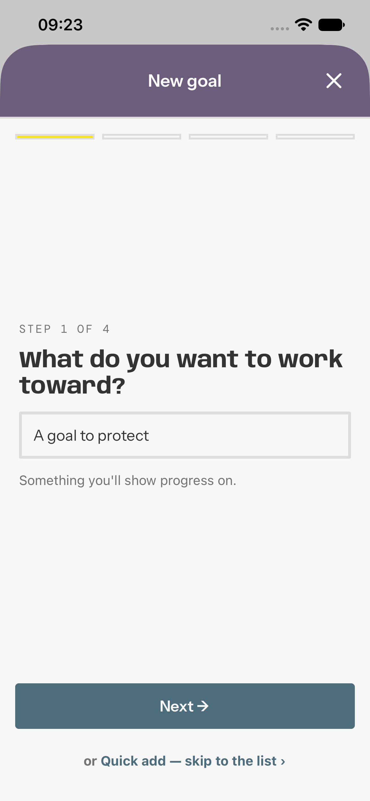
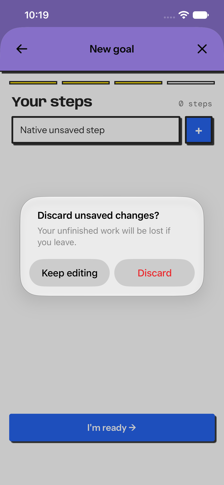
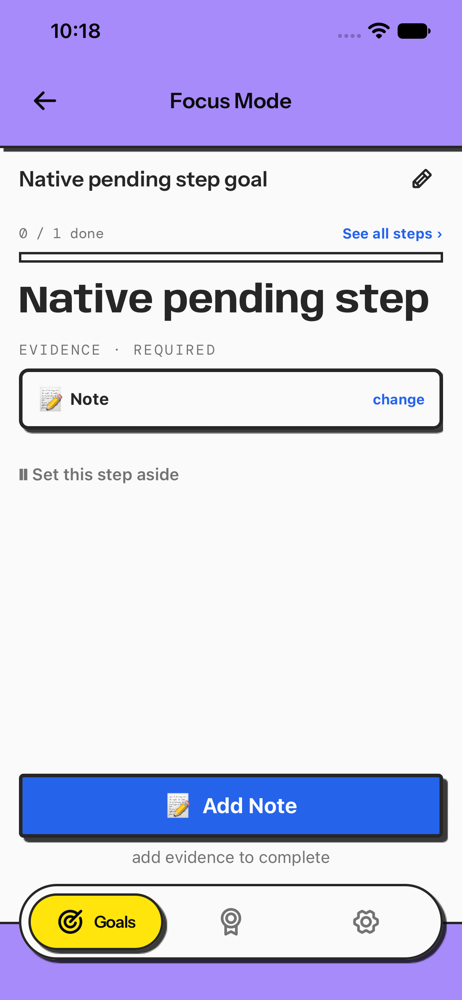

# Issue #685: protect unfinished work — native verification

App source: `cf7a8882c25d0049080d63cae301c527f7a7bbbc`. Baseline: `a7628ddff68851863355133d726e51bba3031d8a`. The later commits on `codex/issue-685` update documentation only. Maestro 2.5.1, English locale, `EXPO_PUBLIC_E2E_MODE=true`.

| Lane    | Environment                                                           | Result                                                                                                                                                                                                                                                                                                                                     | JUnit                                                                                                                                                                             |
| ------- | --------------------------------------------------------------------- | ------------------------------------------------------------------------------------------------------------------------------------------------------------------------------------------------------------------------------------------------------------------------------------------------------------------------------------------ | --------------------------------------------------------------------------------------------------------------------------------------------------------------------------------- |
| iOS     | Disposable iPhone 17e, iOS 27.0; The Full Ride and Still Water themes | Baseline lost a typed goal immediately on Close. Candidate protected dirty wizard Close and modal swipe, Quick Add pending step, text/link header and native left-edge swipes. Keep retained drafts, Discard exited, successful text/link saves exited without a discard prompt, and an unsubmitted Quick Add step survived Start Working. | [Exact-source gesture/save flow](ios-exact-exits-cf7a888.xml)                                                                                                                     |
| Android | Disposable Pixel 8 AVD, Android API 36, ARM64; Still Water theme      | System Back protected wizard, Quick Add, link and text drafts. Voice reached Recording, Paused, Recording complete, and Playing; Back offered the choice in paused, recorded, playing and captioned states. Keep retained the draft, Discard returned to Focus.                                                                            | [Wizard/Quick Add](android-back-cf7a888.xml), [text/link](android-evidence-cf7a888.xml), [voice](android-voice-cf7a888.xml), [voice playback](android-voice-playback-cf7a888.xml) |

The iOS baseline closed a dirty wizard without a choice:

On the candidate, even a typed but unsubmitted Quick Add step triggered a clear choice:

After choosing to continue through Start Working, that pending step appeared in Focus:

The Android SDK was located at `/Volumes/SpinDrive/runner-ci/android-sdk`. The app built successfully with a private two-job CMake/Ninja wrapper and the repository's `scripts/run-android.sh --no-bundler`; the Android package script shortened `JAVA_HOME` on this host. The emulator needed `-no-audio` to avoid a CoreAudio startup hang, but its virtual microphone still supported the tested recording and playback states. Android and iOS simulators, Metro servers, and Gradle daemons were stopped after verification.

The exact app source passed root install/patch checks, type-check, lint (existing warnings), 222 native Jest suites / 10,485 tests, an iOS Xcode build, and an Android Gradle build. The iOS Xcode 27 build required `CLANG_ENABLE_EXPLICIT_MODULES=NO COMPILER_INDEX_STORE_ENABLE=NO -jobs 2` because the default explicit-module path failed in Sentry's `_DarwinFoundation1` import. Three sequential reviewer perspectives found no remaining confirmed draft-loss path; CodeRabbit CLI returned HTTP 403 `Invalid organization` and produced no verdict.

Limits: iOS virtual microphone and physical-device assistive technology were not tested. The seven-theme and locale matrix was covered by component/source checks, not exhaustively replayed natively. A possible recorder-resource leak if reset/unmount occurs during asynchronous audio preparation remains unreproduced and is recorded as a P2 follow-up in the [development plan](../../../docs/plans/dev-plans/issue-685-protect-unfinished-work.md).
